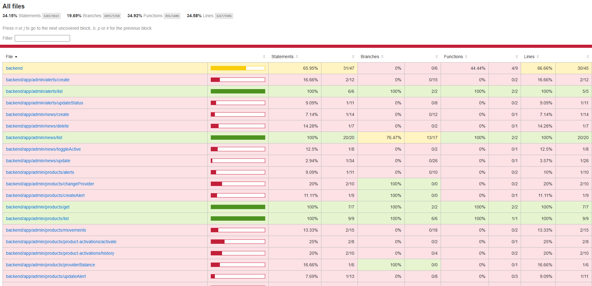

# Hackaton Plan

## Instructions:

1. Install `Live server` extension on your code editor
   
2. Run the command `npm run test:coverage` on the root of the backend project
3. Check the folder `coverage` and the file `coverage/index.html` to see the coverage of the tests
4. Open the file `coverage/index.html` with Live server
   
5. Open the browser and go to `http://localhost:5500/backend/coverage/index.html` to see the current coverage progress
   
6. Make git pull to `master` branch and create a new branch for your team named `hackaton-<team-name>`, for example `hackaton-friday-deployers`, all in lowercase separated by `-`.
7. Start coding!

## Rules:

- Your team will be assigned a random list of files to cover, each route you get to 100% coverage, you get to points for each statement you complete, but *ONLY ROUTES WITH 100% COVERAGE WILL BE CONSIDERED*.
- If the difference between the completed statements is less than 3, between 2 or more teams, it will be considered as a tie and the prize will be divided between the teams.
- Each `route.ts` file your team have must have a test file named `e2e.test.ts` in the same directory.
- Make 1 commit per file you cover.
- You have until 5 pm to code tests and make commits. NOTE: commits made after 5 pm will not be considered.
- The 3 teams with the highest scores will win a prize, each prize will be divided between the team members equally. Each person will be able to do whatever they want with the prize.
- Test with errors or code not covered will not be considered.
- All test files will be reviewed by the jury.
- You can use AI or any tool you want to code tests, but you must understand the code you are writing, and you must be able to explain it to the jury if asked. If it has errors, it will not be considered.
- The winners will be announced on the next week once tests are reviewed.
- Juan David Restrepo will be the jury, he will also be doing test on `Team 6: npm i russian-crypto-miner`, but he will NOT be participating for any prize, he will be doing tests for routes above 40% coverage.

## Prizes:

- First place: $800.000 COP ≈ $210 USD
- Second place: $500.000 COP ≈ $130 USD
- Third place: $200.000 COP ≈ $52 USD

## Recommendations:

- Take breaks
- Drink water
- Eat healthy
- Enjoy, this is NOT a competition for money, it is a competition for fun and learning, the prizes are just an incentive for the effort, but not the main goal.

## Groups:

### Group 1: `Ariel` & `Julián`

### Group 2: `John Edward` & `Sebas Marulanda`

### Group 3: `Jhon Ureta` & `Juan Esteban`

### Group 4: `Luis Fernando` & `Pablo`

### Group 5: `Sebas Flórez` & `Jose`

### Group 6: `Juan David`

### Team 1: Friday Deployers

**Total Missing Statements to Cover**: 555

- backend/app/jobs/providers/biller-refresh-pdp/class (Missing: 104, Current: 0.95%)
- backend/app/transactions/bemovil/notify (Missing: 45, Current: 6.25%)
- backend/app/transactions/notifyBuy (Missing: 42, Current: 6.66%)
- backend/app/partners/commerces (Missing: 31, Current: 6.06%)
- backend/app/auth/update-banner (Missing: 27, Current: 3.57%)
- backend/app/jobs/transactions/bepay-process (Missing: 23, Current: 8.0%)
- backend/app/partners/toggleBlock (Missing: 21, Current: 8.69%)
- backend/app/credits/requestCreditDecide (Missing: 19, Current: 9.52%)
- backend/app/negotiations/update (Missing: 18, Current: 10.0%)
- backend/app/auth/deviceConfirm (Missing: 17, Current: 10.52%)
- backend/app/transactions/payment/processPayment (Missing: 16, Current: 11.11%)
- backend/app/partners/businessSummary (Missing: 14, Current: 12.5%)
- backend/app/autoloans/configure (Missing: 13, Current: 13.33%)
- backend/app/identity-session/session (Missing: 13, Current: 13.33%)
- backend/app/auth/set-banner-comment (Missing: 12, Current: 7.69%)
- backend/app/credits/ActiveButton (Missing: 12, Current: 7.69%)
- backend/app/admin/alerts/create (Missing: 10, Current: 16.66%)
- backend/app/admin/alerts/updateStatus (Missing: 10, Current: 9.09%)
- backend/app/auth/validatePin (Missing: 10, Current: 9.09%)
- backend/app/identity-session/session/get (Missing: 10, Current: 9.09%)
- backend/app/auth/closeSession (Missing: 9, Current: 18.18%)
- backend/app/identity-session/session/extend (Missing: 9, Current: 10.0%)
- backend/app/auth/manualValidation (Missing: 8, Current: 20.0%)
- backend/app/auth/toggle-welcome-banner-active (Missing: 8, Current: 11.11%)
- backend/app/auth/getRegisterData (Missing: 7, Current: 12.5%)
- backend/app/identity-session/session/status (Missing: 7, Current: 12.5%)
- backend/app/autoloans/get (Missing: 6, Current: 14.28%)
- backend/app/credits/requestCredit (Missing: 6, Current: 25.0%)
- backend/app/admin/products/providerBalance (Missing: 5, Current: 16.66%)
- backend/app/identity-session/session/data (Missing: 5, Current: 16.66%)
- backend/app/partners/groupEdit (Missing: 5, Current: 16.66%)
- backend/app/partners/setGroupDefault (Missing: 4, Current: 20.0%)
- backend/app/users/tasks (Missing: 4, Current: 20.0%)
- backend/app/products/getDescription (Missing: 3, Current: 25.0%)
- backend/app/autoloans/delete (Missing: 2, Current: 33.33%)

### Team 2: 404 Team Not Found

**Total Missing Statements to Cover**: 556

- backend/app/jobs/providers/refresh-billers-provider/class (Missing: 93, Current: 1.06%)
- backend/app/auth/register (Missing: 45, Current: 4.25%)
- backend/app/auth/welcomeAlertsCreate (Missing: 42, Current: 2.32%)
- backend/app/admin/news/update (Missing: 33, Current: 2.94%)
- backend/app/credits/installment/notify (Missing: 30, Current: 6.25%)
- backend/app/products/byMassive (Missing: 27, Current: 6.89%)
- backend/app/users/awards/claim (Missing: 22, Current: 8.33%)
- backend/app/auth/banner-request (Missing: 19, Current: 9.52%)
- backend/app/jobs/loans/autoloans (Missing: 19, Current: 9.52%)
- backend/app/auth/forgotPassword (Missing: 17, Current: 10.52%)
- backend/app/credits/pay (Missing: 16, Current: 11.11%)
- backend/app/partners/groupClone (Missing: 14, Current: 12.5%)
- backend/app/auth/welcomeBannerConfigDays (Missing: 13, Current: 7.14%)
- backend/app/jobs/providers/recaudos-plus (Missing: 13, Current: 13.33%)
- backend/app/auth/mfa/associate (Missing: 12, Current: 7.69%)
- backend/app/partners/updateGroup (Missing: 12, Current: 7.69%)
- backend/app/users/create (Missing: 11, Current: 15.38%)
- backend/app/auth/closeOtherSessions (Missing: 10, Current: 16.66%)
- backend/app/credits/unblockHierarchy (Missing: 10, Current: 16.66%)
- backend/app/negotiations/change-status (Missing: 10, Current: 16.66%)
- backend/app/feature-flags/check (Missing: 9, Current: 18.18%)
- backend/app/partners/business/changeGroup (Missing: 9, Current: 10.0%)
- backend/app/auth/toggle-banner-active (Missing: 8, Current: 11.11%)
- backend/app/roles/update (Missing: 8, Current: 20.0%)
- backend/app/credits/getAccessCredit (Missing: 7, Current: 12.5%)
- backend/app/roles/create (Missing: 7, Current: 22.22%)
- backend/app/credits/get (Missing: 6, Current: 14.28%)
- backend/app/negotiations/details (Missing: 6, Current: 25.0%)
- backend/app/auth/sessions (Missing: 5, Current: 16.66%)
- backend/app/jobs/loans/autoloan-clear (Missing: 5, Current: 28.57%)
- backend/app/credits/setupAlert (Missing: 4, Current: 20.0%)
- backend/app/feature-flags/toggle (Missing: 4, Current: 33.33%)
- backend/app/admin/providers/update (Missing: 3, Current: 25.0%)
- backend/app/commerces/bepay/cities (Missing: 3, Current: 25.0%)
- backend/app/auth/validateIdentityAuto (Missing: 2, Current: 33.33%)
- backend/app/partners/countCommerces (Missing: 2, Current: 33.33%)

### Team 3: Merge With Conflicts

**Total Missing Statements to Cover**: 557

- backend/app/admin/transactions/buysToApprove (Missing: 90, Current: 2.17%)
- backend/app/partners/updateCommerce (Missing: 60, Current: 3.22%)
- backend/app/users/feedback (Missing: 38, Current: 5.0%)
- backend/app/credits/ownPay (Missing: 31, Current: 6.06%)
- backend/app/webhooks/whatsapp/webhook (Missing: 28, Current: 3.44%)
- backend/app/credits/newCredit (Missing: 24, Current: 7.69%)
- backend/app/credits/ownList (Missing: 21, Current: 8.69%)
- backend/app/transactions/bemovil/approveBuyBalance (Missing: 20, Current: 9.09%)
- backend/app/partners/findDocument (Missing: 18, Current: 5.26%)
- backend/app/auth/changePassword (Missing: 17, Current: 5.55%)
- backend/app/jobs/transactions/notify (Missing: 15, Current: 16.66%)
- backend/app/identity-session/session/complete (Missing: 14, Current: 12.5%)
- backend/app/admin/products/movements (Missing: 13, Current: 13.33%)
- backend/app/credits/disbursement/notify (Missing: 13, Current: 13.33%)
- backend/app/transactions/createResource (Missing: 13, Current: 18.75%)
- backend/app/jobs/providers/biller-refresh-pdp (Missing: 11, Current: 15.38%)
- backend/app/jobs/providers/refresh-billers-provider (Missing: 11, Current: 15.38%)
- backend/app/admin/transactions/instantBuy (Missing: 10, Current: 16.66%)
- backend/app/auth/requestNewTokenWhatsapp (Missing: 10, Current: 9.09%)
- backend/app/jobs/users/quota/block-past-due-debt (Missing: 10, Current: 16.66%)
- backend/app/products/activation (Missing: 10, Current: 9.09%)
- backend/app/admin/products/createAlert (Missing: 8, Current: 11.11%)
- backend/app/admin/products/product-activations/history (Missing: 8, Current: 20.0%)
- backend/app/partners/blockBusiness (Missing: 8, Current: 11.11%)
- backend/app/transactions/massiveValidate (Missing: 8, Current: 11.11%)
- backend/app/admin/news/delete (Missing: 6, Current: 14.28%)
- backend/app/admin/products/product-activations/activate (Missing: 6, Current: 25.0%)
- backend/app/jobs/users/block-inactive (Missing: 6, Current: 25.0%)
- backend/app/partners/getGroup (Missing: 6, Current: 25.0%)
- backend/app/negotiations/create (Missing: 5, Current: 28.57%)
- backend/app/partners/historyBusiness (Missing: 5, Current: 28.57%)
- backend/app/transactions/soat/purchase (Missing: 4, Current: 33.33%)
- backend/app/auth/toggleLimitSales (Missing: 3, Current: 25.0%)
- backend/app/commerces/create (Missing: 3, Current: 25.0%)
- backend/app/jobs/providers/bepay-login (Missing: 2, Current: 33.33%)
- backend/app/transactions/buyNotify (Missing: 2, Current: 33.33%)

### Team 4: Infinite Loopers

**Total Missing Statements to Cover**: 555

- backend/app/jobs/transactions/process-massive/class (Missing: 87, Current: 2.24%)
- backend/app/partners/findChild (Missing: 63, Current: 3.07%)
- backend/app/commerces/updateBusiness (Missing: 35, Current: 5.4%)
- backend/app/identity-session/session/uncompleted (Missing: 32, Current: 3.03%)
- backend/app/certificates/listCertificatesTemplate (Missing: 29, Current: 9.37%)
- backend/app/auth/create-banner (Missing: 24, Current: 4.0%)
- backend/app/certificates/validate (Missing: 22, Current: 8.33%)
- backend/app/auth/welcomeAlerts (Missing: 19, Current: 9.52%)
- backend/app/jobs/loans/alert-loans (Missing: 19, Current: 9.52%)
- backend/app/auth/restorePassword (Missing: 17, Current: 10.52%)
- backend/app/partners/downloadCard (Missing: 17, Current: 10.52%)
- backend/app/admin/news/create (Missing: 13, Current: 7.14%)
- backend/app/auth/confirmIdentity (Missing: 13, Current: 7.14%)
- backend/app/products/toogleFavoriteProducts (Missing: 13, Current: 13.33%)
- backend/app/admin/products/updateAlert (Missing: 12, Current: 7.69%)
- backend/app/users/delete (Missing: 12, Current: 7.69%)
- backend/app/transactions/massiveTransfersConfirmFile (Missing: 11, Current: 15.38%)
- backend/app/auth/mfa/generate (Missing: 10, Current: 9.09%)
- backend/app/commerces/getDistributorContact (Missing: 10, Current: 9.09%)
- backend/app/partners/deleteGroup (Missing: 10, Current: 16.66%)
- backend/app/auth/getOtp (Missing: 9, Current: 10.0%)
- backend/app/partners/deleteBusiness (Missing: 9, Current: 10.0%)
- backend/app/auth/set-status-banner (Missing: 8, Current: 20.0%)
- backend/app/transactions/massiveTransfersBanksConfirmFile (Missing: 8, Current: 20.0%)
- backend/app/auth/identities/details (Missing: 7, Current: 12.5%)
- backend/app/transactions/soat/consult (Missing: 7, Current: 22.22%)
- backend/app/commerces/updateMeta (Missing: 6, Current: 14.28%)
- backend/app/partners/drawHierarchy (Missing: 6, Current: 25.0%)
- backend/app/auth/dissableAccount (Missing: 5, Current: 16.66%)
- backend/app/jobs/providers/snapshot (Missing: 5, Current: 28.57%)
- backend/app/brain/get (Missing: 4, Current: 20.0%)
- backend/app/negotiations/add-comment (Missing: 4, Current: 20.0%)
- backend/app/admin/providers/get (Missing: 3, Current: 25.0%)
- backend/app/commerces/bepay/states (Missing: 3, Current: 25.0%)
- backend/app/users/registerInsight (Missing: 3, Current: 25.0%)

### Team 5: Push --force

**Total Missing Statements to Cover**: 557

- backend/app/certificates/register (Missing: 77, Current: 4.93%)
- backend/app/jobs/providers/recaudos-plus/class (Missing: 67, Current: 1.47%)
- backend/app/notifications/register (Missing: 42, Current: 4.54%)
- backend/app/jobs/providers/biller-refresh (Missing: 32, Current: 5.88%)
- backend/app/certificates/get (Missing: 28, Current: 9.67%)
- backend/app/admin/transactions/approveBuy (Missing: 25, Current: 10.71%)
- backend/app/credits/register/FormCreditExternal (Missing: 21, Current: 4.54%)
- backend/app/partners/createCommerce (Missing: 20, Current: 9.09%)
- backend/app/transactions/massiveConfirm (Missing: 18, Current: 10.0%)
- backend/app/admin/products/updateValidations (Missing: 17, Current: 10.52%)
- backend/app/transactions/payment/generateLink (Missing: 15, Current: 11.76%)
- backend/app/commerces/uploadAsset (Missing: 14, Current: 6.66%)
- backend/app/admin/providers/movements (Missing: 13, Current: 13.33%)
- backend/app/autoloans/update (Missing: 13, Current: 7.14%)
- backend/app/users/update (Missing: 13, Current: 13.33%)
- backend/app/auth/requestNewToken (Missing: 11, Current: 8.33%)
- backend/app/partners/createGroup (Missing: 11, Current: 15.38%)
- backend/app/admin/products/alerts (Missing: 10, Current: 9.09%)
- backend/app/auth/secondPassword (Missing: 10, Current: 9.09%)
- backend/app/identity-session/session/update-status (Missing: 10, Current: 9.09%)
- backend/app/roles/privileges (Missing: 10, Current: 16.66%)
- backend/app/admin/products/changeProvider (Missing: 8, Current: 20.0%)
- backend/app/auth/delete-request-banner (Missing: 8, Current: 11.11%)
- backend/app/notifications/get (Missing: 8, Current: 20.0%)
- backend/app/admin/news/toggleActive (Missing: 7, Current: 12.5%)
- backend/app/products/assigned (Missing: 7, Current: 12.5%)
- backend/app/auth/loginToken (Missing: 6, Current: 14.28%)
- backend/app/jobs/transactions/process-massive (Missing: 6, Current: 25.0%)
- backend/app/users/getBrebKeys (Missing: 6, Current: 14.28%)
- backend/app/jobs/users/snapshot (Missing: 5, Current: 28.57%)
- backend/app/auth/banners (Missing: 4, Current: 33.33%)
- backend/app/partners/addHistory (Missing: 4, Current: 20.0%)
- backend/app/users/toggleBlock (Missing: 4, Current: 20.0%)
- backend/app/credits/me (Missing: 3, Current: 25.0%)
- backend/app/commerces/getBusinessTypes (Missing: 2, Current: 0.0%)
- backend/app/transactions/massiveTransfersValidateFile (Missing: 2, Current: 33.33%)

### Team 6: npm i russian-crypto-miner

**Total Missing Statements to Cover**: 139

- backend/app/transactions/sell (Missing: 36, Current: 62.1%)
- backend/app/auth/identities/list (Missing: 19, Current: 56.81%)
- backend/app/transactions/reverseBalance (Missing: 10, Current: 72.97%)
- backend/app/auth/login (Missing: 8, Current: 71.42%)
- backend/app/products/get (Missing: 8, Current: 77.14%)
- backend/app/certificates/list (Missing: 7, Current: 80.55%)
- backend/app/transactions/createPayment (Missing: 7, Current: 68.18%)
- backend/app/transactions/bepay/notify (Missing: 5, Current: 44.44%)
- backend/app/visitant/lead (Missing: 5, Current: 86.48%)
- backend/app/transactions/get (Missing: 4, Current: 89.18%)
- backend/app/transactions/list (Missing: 4, Current: 95.4%)
- backend/app/transactions/query (Missing: 4, Current: 86.2%)
- backend/app/credits/deleteAlertLoan (Missing: 3, Current: 40.0%)
- backend/app/negotiations/comments (Missing: 3, Current: 40.0%)
- backend/app/transactions/listPaymentMethods (Missing: 3, Current: 84.21%)
- backend/app/transactions/patmentMethods/cost (Missing: 3, Current: 83.33%)
- backend/app/auth/isUserValidated (Missing: 2, Current: 77.77%)
- backend/app/products/list (Missing: 2, Current: 71.42%)
- backend/app/transactions/massiveReport (Missing: 2, Current: 81.81%)
- backend/app/auth/banner-request-list (Missing: 1, Current: 87.5%)
- backend/app/auth/list-banners (Missing: 1, Current: 83.33%)
- backend/app/notifications/massiveValidate (Missing: 1, Current: 50.0%)
- backend/app/transactions/assignBalance (Missing: 1, Current: 96.0%)

